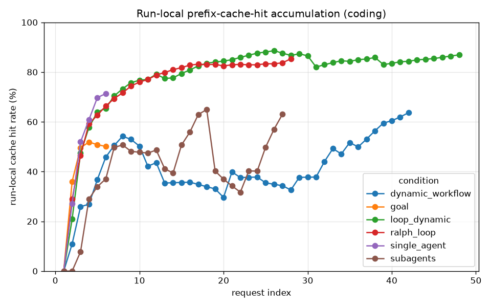
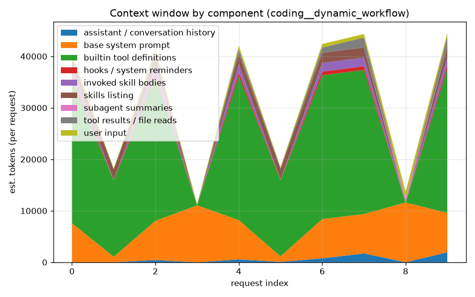
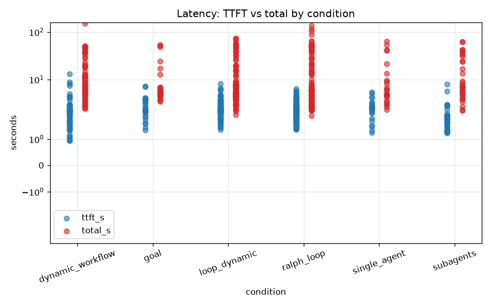
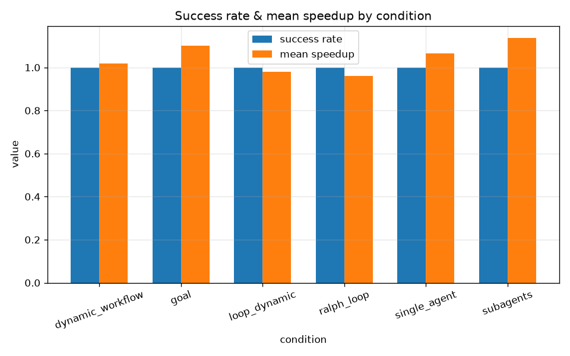

# Experiment Report

Runs analyzed: **36**.  (Build-only subset; narrative filled after the full sweep.)

## ECharts chart plan

- Experiment matrix: status for every task / condition / repetition cell.
- Condition comparison: switchable aggregate metrics for success, latency, requests, cost, quality, cache, and token pressure.
- Condition overhead vs single-agent baseline: normalized feature cost for subagents, loops, dynamic workflow, and loop+dynamic.
- Quality vs cost map: coding speedup or research rubric score against estimated API-equivalent dollar cost.
- Prefix Cache Hit Rate (accumulated): run-local cache-hit rate adjusted for warm cache already present on the first request of each request type; tooltips also show the observed/global rate.
- TTFT vs prompt tokens: latency scaling as prompt/context grows.
- Per-run request cost timeline: selected-run request sequence with input/cache-read/cache-write/output tokens, estimated request cost, and TTFT/total latency.
- Context source breakdown: estimated per-request context composition by source, including system prompt, tools, MCP/extensions, CLAUDE.md/project instructions, skills, memory, hooks, user input, conversation history, tool results, and subagent summaries.

## Interactive ECharts dashboard

[Interactive ECharts dashboard](report.html)

<iframe src="report.html" width="100%" height="1400" title="Interactive ECharts dashboard"></iframe>

## Cost and quality scoring

Costs are estimated API-equivalent Claude Sonnet 4.6 token costs from the captured token categories: base input, 5m cache writes, 1h cache writes, cache reads, and output. Non-token add-on fees, if any, are not included.

Coding quality is the KernelGYM `speedup` for successful runs. Research quality is a deterministic rubric score over required sections, citation balance, length, and lightweight keyword coverage.

## Condition-level quality / cost summary

| task     | condition        |   runs |   mean_speedup |   mean_research_rubric_score |   mean_quality_score |   mean_total_cost_usd |   mean_cost_efficiency_score |
|:---------|:-----------------|-------:|---------------:|-----------------------------:|---------------------:|----------------------:|-----------------------------:|
| coding   | subagents        |      3 |         2.2728 |                              |               2.2728 |                0.2579 |                       8.9612 |
| coding   | goal             |      3 |         2.2013 |                              |               2.2013 |                0.2158 |                      10.3332 |
| coding   | single_agent     |      3 |         2.1327 |                              |               2.1327 |                0.1654 |                      12.9466 |
| coding   | dynamic_workflow |      3 |         2.0386 |                              |               2.0386 |                0.2615 |                       7.8577 |
| coding   | loop_dynamic     |      3 |         1.9581 |                              |               1.9581 |                0.2503 |                       7.891  |
| coding   | ralph_loop       |      3 |         1.9204 |                              |               1.9204 |                0.5111 |                       3.8673 |
| research | goal             |      3 |                |                      99.4037 |              99.4037 |                0.256  |                     418.904  |
| research | dynamic_workflow |      3 |                |                      98.6111 |              98.6111 |                0.8804 |                     120.477  |
| research | ralph_loop       |      3 |                |                      98.6111 |              98.6111 |                1.1963 |                      82.4299 |
| research | loop_dynamic     |      3 |                |                      97.6804 |              97.6804 |                1.617  |                      62.9191 |
| research | subagents        |      3 |                |                      96.6704 |              96.6704 |                0.5628 |                     229.442  |
| research | single_agent     |      3 |                |                      96.0926 |              96.0926 |                0.3667 |                     305.345  |

## Coding ranking by speedup

| condition        |   rep | success   |   speedup |   total_cost_usd |   input_cost_usd |   cache_read_cost_usd |   cache_creation_5m_cost_usd |   cache_creation_1h_cost_usd |   output_cost_usd |   speedup_per_dollar |   num_requests |   completion_time_s | run_id                                         |
|:-----------------|------:|:----------|----------:|-----------------:|-----------------:|----------------------:|-----------------------------:|-----------------------------:|------------------:|---------------------:|---------------:|--------------------:|:-----------------------------------------------|
| single_agent     |     3 | True      |    2.4012 |           0.1721 |           0.0002 |                0.0494 |                       0      |                       0.0935 |            0.029  |              13.9537 |              5 |             35.0562 | coding__single_agent__03__20260622T025432Z     |
| subagents        |     1 | True      |    2.3728 |           0.2797 |           0.0007 |                0.0433 |                       0.0826 |                       0.1068 |            0.0463 |               8.4832 |              8 |             56.1552 | coding__subagents__01__20260622T025538Z        |
| goal             |     3 | True      |    2.3675 |           0.2147 |           0.0005 |                0.0407 |                       0.0375 |                       0.106  |            0.03   |              11.0252 |              6 |             44.8569 | coding__goal__03__20260622T201917Z             |
| subagents        |     2 | True      |    2.2989 |           0.2145 |           0.0007 |                0.0549 |                       0.0227 |                       0.1008 |            0.0355 |              10.7176 |              9 |             54.1806 | coding__subagents__02__20260622T025655Z        |
| dynamic_workflow |     1 | True      |    2.1944 |           0.3076 |           0.0005 |                0.0838 |                       0.0693 |                       0.1132 |            0.0408 |               7.1346 |             10 |             42.5521 | coding__dynamic_workflow__01__20260622T031908Z |
| single_agent     |     1 | True      |    2.1813 |           0.1524 |           0.0002 |                0.0488 |                       0      |                       0.0871 |            0.0163 |              14.3131 |              5 |             28.1448 | coding__single_agent__01__20260622T025228Z     |
| subagents        |     3 | True      |    2.1467 |           0.2794 |           0.0011 |                0.0805 |                       0.0236 |                       0.1226 |            0.0515 |               7.6827 |             12 |             65.6392 | coding__subagents__03__20260622T025817Z        |
| goal             |     1 | True      |    2.1344 |           0.2471 |           0.0002 |                0.0333 |                       0.0323 |                       0.1639 |            0.0173 |               8.6375 |              5 |             32.3871 | coding__goal__01__20260622T201744Z             |
| goal             |     2 | True      |    2.1022 |           0.1854 |           0.0002 |                0.0366 |                       0.0324 |                       0.0984 |            0.0177 |              11.3368 |              5 |             37.7302 | coding__goal__02__20260622T201829Z             |
| loop_dynamic     |     2 | True      |    2.0957 |           0.2326 |           0.0005 |                0.1031 |                       0      |                       0.0967 |            0.0323 |               9.0105 |             10 |             53.0861 | coding__loop_dynamic__02__20260622T033209Z     |
| ralph_loop       |     1 | True      |    2.0695 |           0.511  |           0.0005 |                0.1282 |                       0      |                       0.2006 |            0.1817 |               4.0499 |             12 |            187.715  | coding__ralph_loop__01__20260622T030700Z       |
| dynamic_workflow |     3 | True      |    2.0521 |           0.2467 |           0.0003 |                0.0794 |                       0.0126 |                       0.1132 |            0.0412 |               8.317  |              8 |             51.5568 | coding__dynamic_workflow__03__20260622T032141Z |
| ralph_loop       |     2 | True      |    2.0207 |           0.4249 |           0.0005 |                0.0896 |                       0      |                       0.1772 |            0.1577 |               4.7554 |              9 |            171.43   | coding__ralph_loop__02__20260622T031026Z       |
| loop_dynamic     |     1 | True      |    1.9896 |           0.2457 |           0.0005 |                0.0916 |                       0      |                       0.1058 |            0.0478 |               8.0969 |              9 |             73.6904 | coding__loop_dynamic__01__20260622T033035Z     |
| dynamic_workflow |     2 | True      |    1.8693 |           0.2302 |           0.0005 |                0.083  |                       0.0125 |                       0.1046 |            0.0296 |               8.1217 |              9 |             65.093  | coding__dynamic_workflow__02__20260622T032011Z |
| single_agent     |     2 | True      |    1.8157 |           0.1717 |           0.0002 |                0.0492 |                       0      |                       0.0933 |            0.029  |              10.5731 |              5 |             40.8568 | coding__single_agent__02__20260622T025330Z     |
| loop_dynamic     |     3 | True      |    1.789  |           0.2725 |           0.0007 |                0.1207 |                       0      |                       0.105  |            0.046  |               6.5656 |             12 |             67.7155 | coding__loop_dynamic__03__20260622T033322Z     |
| ralph_loop       |     3 | True      |    1.6709 |           0.5975 |           0.0012 |                0.2017 |                       0      |                       0.2121 |            0.1825 |               2.7967 |             19 |            203.131  | coding__ralph_loop__03__20260622T031336Z       |

## Research ranking by rubric score

| condition        |   rep | success   |   research_rubric_score |   research_format_score |   research_coverage_score |   research_word_count |   research_exact_two_url_sections |   total_cost_usd |   input_cost_usd |   cache_read_cost_usd |   cache_creation_5m_cost_usd |   cache_creation_1h_cost_usd |   output_cost_usd |   research_score_per_dollar |   num_requests |   completion_time_s | run_id                                           |
|:-----------------|------:|:----------|------------------------:|------------------------:|--------------------------:|----------------------:|----------------------------------:|-----------------:|-----------------:|----------------------:|-----------------------------:|-----------------------------:|------------------:|----------------------------:|---------------:|--------------------:|:-------------------------------------------------|
| goal             |     2 | True      |                100      |                  1      |                    1      |                   937 |                                 6 |           0.2024 |           0      |                0.0333 |                       0.0352 |                       0.0924 |            0.0415 |                    494.054  |              4 |             69.4292 | research__goal__02__20260622T201459Z             |
| ralph_loop       |     2 | True      |                100      |                  1      |                    1      |                  1014 |                                 6 |           1.2152 |           0.0003 |                0.3426 |                       0      |                       0.4857 |            0.3866 |                     82.2919 |             27 |            544.057  | research__ralph_loop__02__20260621T192411Z       |
| goal             |     1 | True      |                 99.6    |                  0.994  |                    1      |                   864 |                                 6 |           0.3641 |           0      |                0.0246 |                       0.0354 |                       0.2639 |            0.0402 |                    273.539  |              4 |             68.7889 | research__goal__01__20260622T201340Z             |
| goal             |     3 | True      |                 98.6111 |                  1      |                    0.9444 |                   957 |                                 6 |           0.2016 |           0      |                0.0333 |                       0.0353 |                       0.092  |            0.0411 |                    489.12   |              4 |             71.3476 | research__goal__03__20260622T201619Z             |
| dynamic_workflow |     1 | True      |                 98.6111 |                  1      |                    0.9444 |                   939 |                                 6 |           0.6786 |           0.0001 |                0.0987 |                       0.2006 |                       0.19   |            0.1892 |                    145.325  |             12 |            169.743  | research__dynamic_workflow__01__20260621T190528Z |
| dynamic_workflow |     2 | True      |                 98.6111 |                  1      |                    0.9444 |                   909 |                                 6 |           0.7216 |           0      |                0.1039 |                       0.1606 |                       0.2398 |            0.2173 |                    136.648  |              9 |            246.44   | research__dynamic_workflow__02__20260621T193345Z |
| ralph_loop       |     3 | True      |                 98.6111 |                  1      |                    0.9444 |                   922 |                                 6 |           1.1832 |           0.0001 |                0.3482 |                       0      |                       0.4639 |            0.3711 |                     83.3401 |             27 |            519.65   | research__ralph_loop__03__20260621T195102Z       |
| dynamic_workflow |     3 | True      |                 98.6111 |                  1      |                    0.9444 |                   919 |                                 6 |           1.2411 |           0.2729 |                0.197  |                       0.2309 |                       0.2191 |            0.3211 |                     79.4576 |             42 |            232.249  | research__dynamic_workflow__03__20260621T200016Z |
| loop_dynamic     |     2 | True      |                 98.6111 |                  1      |                    0.9444 |                  1386 |                                 6 |           1.3518 |           0.0001 |                0.5417 |                       0      |                       0.4931 |            0.3169 |                     72.9496 |             30 |            460.46   | research__loop_dynamic__02__20260621T193824Z     |
| loop_dynamic     |     3 | True      |                 98.5968 |                  0.9998 |                    0.9444 |                  1401 |                                 6 |           1.4095 |           0.0001 |                0.5026 |                       0      |                       0.5333 |            0.3735 |                     69.9505 |             29 |            503.017  | research__loop_dynamic__03__20260621T200445Z     |
| subagents        |     2 | True      |                 98.3444 |                  0.996  |                    0.9444 |                   876 |                                 6 |           0.2341 |           0.0002 |                0.0546 |                       0.0137 |                       0.1011 |            0.0644 |                    420.07   |             18 |            155.274  | research__subagents__02__20260622T005529Z        |
| single_agent     |     3 | True      |                 97.2222 |                  1      |                    0.8889 |                  1392 |                                 6 |           0.3242 |           0      |                0.0729 |                       0      |                       0.1713 |            0.08   |                    299.881  |              6 |            124.744  | research__single_agent__03__20260621T194643Z     |
| single_agent     |     1 | True      |                 97.2222 |                  1      |                    0.8889 |                   985 |                                 6 |           0.5647 |           0      |                0.0135 |                       0      |                       0.5116 |            0.0395 |                    172.178  |              3 |             65.6377 | research__single_agent__01__20260621T185216Z     |
| subagents        |     1 | True      |                 97.2222 |                  1      |                    0.8889 |                  1189 |                                 6 |           0.6363 |           0.0002 |                0.0396 |                       0.0755 |                       0.3718 |            0.1492 |                    152.784  |             17 |            271.711  | research__subagents__01__20260622T005021Z        |
| ralph_loop       |     1 | True      |                 97.2222 |                  1      |                    0.8889 |                   903 |                                 6 |           1.1906 |           0.0001 |                0.3735 |                       0      |                       0.4571 |            0.36   |                     81.6578 |             28 |            497.506  | research__ralph_loop__01__20260621T185631Z       |
| loop_dynamic     |     1 | True      |                 95.8333 |                  1      |                    0.8333 |                  1015 |                                 6 |           2.0898 |           0.0032 |                0.6715 |                       0      |                       1.1346 |            0.2805 |                     45.8572 |             48 |            424.346  | research__loop_dynamic__01__20260621T190900Z     |
| subagents        |     3 | True      |                 94.4444 |                  1      |                    0.7778 |                   995 |                                 6 |           0.8179 |           0.2079 |                0.0884 |                       0.1148 |                       0.13   |            0.2768 |                    115.472  |             27 |            280.71   | research__subagents__03__20260622T014941Z        |
| single_agent     |     2 | True      |                 93.8333 |                  0.97   |                    0.8333 |                   720 |                                 6 |           0.2113 |           0      |                0.0313 |                       0      |                       0.1497 |            0.0303 |                    443.976  |              3 |             53.824  | research__single_agent__02__20260621T192106Z     |

## Runs

| run_id                                           | task     | condition        | success   |   speedup |   research_rubric_score |   quality_score |   total_cost_usd |   cost_efficiency_score |   num_requests |   total_cache_read |   total_run_local_cache_read |   cache_hit_ratio |   observed_cache_hit_ratio |   completion_time_s |
|:-------------------------------------------------|:---------|:-----------------|:----------|----------:|------------------------:|----------------:|-----------------:|------------------------:|---------------:|-------------------:|-----------------------------:|------------------:|---------------------------:|--------------------:|
| coding__dynamic_workflow__01__20260622T031908Z   | coding   | dynamic_workflow | True      |    2.1944 |                         |          2.1944 |           0.3076 |                  7.1346 |             10 |             279259 |                        85543 |            0.6951 |                     0.8816 |             42.5521 |
| coding__dynamic_workflow__02__20260622T032011Z   | coding   | dynamic_workflow | True      |    1.8693 |                         |          1.8693 |           0.2302 |                  8.1217 |              9 |             276527 |                        67896 |            0.7643 |                     0.9296 |             65.093  |
| coding__dynamic_workflow__03__20260622T032141Z   | coding   | dynamic_workflow | True      |    2.0521 |                         |          2.0521 |           0.2467 |                  8.317  |              8 |             264710 |                        67038 |            0.7502 |                     0.9222 |             51.5568 |
| coding__goal__01__20260622T201744Z               | coding   | goal             | True      |    2.1344 |                         |          2.1344 |           0.2471 |                  8.6375 |              5 |             111166 |                        25267 |            0.4123 |                     0.7553 |             32.3871 |
| coding__goal__02__20260622T201829Z               | coding   | goal             | True      |    2.1022 |                         |          2.1022 |           0.1854 |                 11.3368 |              5 |             122143 |                        25285 |            0.5015 |                     0.8293 |             37.7302 |
| coding__goal__03__20260622T201917Z               | coding   | goal             | True      |    2.3675 |                         |          2.3675 |           0.2147 |                 11.0252 |              6 |             135766 |                        27949 |            0.5011 |                     0.8299 |             44.8569 |
| coding__loop_dynamic__01__20260622T033035Z       | coding   | loop_dynamic     | True      |    1.9896 |                         |          1.9896 |           0.2457 |                  8.0969 |              9 |             305473 |                        83124 |            0.8237 |                     0.945  |             73.6904 |
| coding__loop_dynamic__02__20260622T033209Z       | coding   | loop_dynamic     | True      |    2.0957 |                         |          2.0957 |           0.2326 |                  9.0105 |             10 |             343673 |                        92691 |            0.8506 |                     0.9548 |             53.0861 |
| coding__loop_dynamic__03__20260622T033322Z       | coding   | loop_dynamic     | True      |    1.789  |                         |          1.789  |           0.2725 |                  6.5656 |             12 |             402345 |                       111771 |            0.863  |                     0.9578 |             67.7155 |
| coding__ralph_loop__01__20260622T030700Z         | coding   | ralph_loop       | True      |    2.0695 |                         |          2.0695 |           0.511  |                  4.0499 |             12 |             427177 |                       118929 |            0.7797 |                     0.9271 |            187.715  |
| coding__ralph_loop__02__20260622T031026Z         | coding   | ralph_loop       | True      |    2.0207 |                         |          2.0207 |           0.4249 |                  4.7554 |              9 |             298700 |                        76351 |            0.72   |                     0.9096 |            171.43   |
| coding__ralph_loop__03__20260622T031336Z         | coding   | ralph_loop       | True      |    1.6709 |                         |          1.6709 |           0.5975 |                  2.7967 |             19 |             672420 |                       216763 |            0.8585 |                     0.9495 |            203.131  |
| coding__single_agent__01__20260622T025228Z       | coding   | single_agent     | True      |    2.1813 |                         |          2.1813 |           0.1524 |                 14.3131 |              5 |             162600 |                        37109 |            0.7177 |                     0.9176 |             28.1448 |
| coding__single_agent__02__20260622T025330Z       | coding   | single_agent     | True      |    1.8157 |                         |          1.8157 |           0.1717 |                 10.5731 |              5 |             163920 |                        38429 |            0.7109 |                     0.9129 |             40.8568 |
| coding__single_agent__03__20260622T025432Z       | coding   | single_agent     | True      |    2.4012 |                         |          2.4012 |           0.1721 |                 13.9537 |              5 |             164672 |                        39181 |            0.7145 |                     0.9132 |             35.0562 |
| coding__subagents__01__20260622T025538Z          | coding   | subagents        | True      |    2.3728 |                         |          2.3728 |           0.2797 |                  8.4832 |              8 |             144404 |                        54261 |            0.5753 |                     0.7828 |             56.1552 |
| coding__subagents__02__20260622T025655Z          | coding   | subagents        | True      |    2.2989 |                         |          2.2989 |           0.2145 |                 10.7176 |              9 |             182885 |                        26414 |            0.5337 |                     0.8879 |             54.1806 |
| coding__subagents__03__20260622T025817Z          | coding   | subagents        | True      |    2.1467 |                         |          2.1467 |           0.2794 |                  7.6827 |             12 |             268423 |                        49350 |            0.6455 |                     0.9083 |             65.6392 |
| research__dynamic_workflow__01__20260621T190528Z | research | dynamic_workflow | True      |           |                 98.6111 |         98.6111 |           0.6786 |                145.325  |             12 |             329040 |                       157242 |            0.6486 |                     0.7944 |            169.743  |
| research__dynamic_workflow__02__20260621T193345Z | research | dynamic_workflow | True      |           |                 98.6111 |         98.6111 |           0.7216 |                136.648  |              9 |             346262 |                       145831 |            0.6378 |                     0.807  |            246.44   |
| research__dynamic_workflow__03__20260621T200016Z | research | dynamic_workflow | True      |           |                 98.6111 |         98.6111 |           1.2411 |                 79.4576 |             42 |             656693 |                       331469 |            0.6368 |                     0.7765 |            232.249  |
| research__goal__01__20260622T201340Z             | research | goal             | True      |           |                 99.6    |         99.6    |           0.3641 |                273.539  |              4 |              82145 |                        82145 |            0.6059 |                     0.6059 |             68.7889 |
| research__goal__02__20260622T201459Z             | research | goal             | True      |           |                100      |        100      |           0.2024 |                494.054  |              4 |             111015 |                        25116 |            0.5033 |                     0.8175 |             69.4292 |
| research__goal__03__20260622T201619Z             | research | goal             | True      |           |                 98.6111 |         98.6111 |           0.2016 |                489.12   |              4 |             110946 |                        25047 |            0.5031 |                     0.8177 |             71.3476 |
| research__loop_dynamic__01__20260621T190900Z     | research | loop_dynamic     | True      |           |                 95.8333 |         95.8333 |           2.0898 |                 45.8572 |             48 |            2238234 |                      1264712 |            0.8693 |                     0.9217 |            424.346  |
| research__loop_dynamic__02__20260621T193824Z     | research | loop_dynamic     | True      |           |                 98.6111 |         98.6111 |           1.3518 |                 72.9496 |             30 |            1805543 |                       946553 |            0.9201 |                     0.9564 |            460.46   |
| research__loop_dynamic__03__20260621T200445Z     | research | loop_dynamic     | True      |           |                 98.5968 |         98.5968 |           1.4095 |                 69.9505 |             29 |            1675217 |                       844860 |            0.9048 |                     0.9496 |            503.017  |
| research__ralph_loop__01__20260621T185631Z       | research | ralph_loop       | True      |           |                 97.2222 |         97.2222 |           1.1906 |                 81.6578 |             28 |            1244837 |                       443113 |            0.8532 |                     0.9423 |            497.506  |
| research__ralph_loop__02__20260621T192411Z       | research | ralph_loop       | True      |           |                100      |        100      |           1.2152 |                 82.2919 |             27 |            1141849 |                       386432 |            0.8266 |                     0.9337 |            544.057  |
| research__ralph_loop__03__20260621T195102Z       | research | ralph_loop       | True      |           |                 98.6111 |         98.6111 |           1.1832 |                 83.3401 |             27 |            1160775 |                       387684 |            0.8337 |                     0.9375 |            519.65   |
| research__single_agent__01__20260621T185216Z     | research | single_agent     | True      |           |                 97.2222 |         97.2222 |           0.5647 |                172.178  |              3 |              44914 |                        44914 |            0.345  |                     0.345  |             65.6377 |
| research__single_agent__02__20260621T192106Z     | research | single_agent     | True      |           |                 93.8333 |         93.8333 |           0.2113 |                443.976  |              3 |             104353 |                        18454 |            0.4251 |                     0.807  |             53.824  |
| research__single_agent__03__20260621T194643Z     | research | single_agent     | True      |           |                 97.2222 |         97.2222 |           0.3242 |                299.881  |              6 |             242854 |                        71056 |            0.7133 |                     0.8948 |            124.744  |
| research__subagents__01__20260622T005021Z        | research | subagents        | True      |           |                 97.2222 |         97.2222 |           0.6363 |                152.784  |             17 |             132042 |                       132042 |            0.6164 |                     0.6164 |            271.711  |
| research__subagents__02__20260622T005529Z        | research | subagents        | True      |           |                 98.3444 |         98.3444 |           0.2341 |                420.07   |             18 |             182042 |                       182042 |            0.8983 |                     0.8983 |            155.274  |
| research__subagents__03__20260622T014941Z        | research | subagents        | True      |           |                 94.4444 |         94.4444 |           0.8179 |                115.472  |             27 |             294752 |                       207080 |            0.6301 |                     0.708  |            280.71   |

## Prefix-cache-hit accumulation (static headline)

## Context growth by prompt component (static headline)

## Latency (TTFT vs total)

## Success rate & speedup

